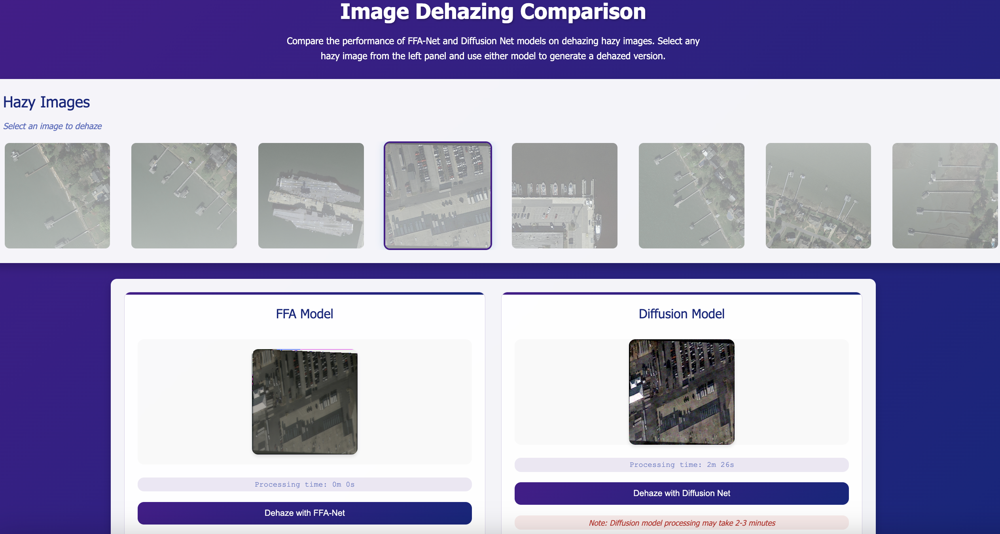

# Image Dehazing Comparison: FFA-Net vs Diffusion Net

## Overview
This project is part of my Georgia Tech OMSCS (Online Master of Science in Computer Science) deep-learning module project, where my project mates and I worked on object detection in hazy situations.

This web-based comparison tool implements two image dehazing models used in the project: FFA-Net and Diffusion Net. The application allows users to select hazy images and compare the dehazing results from both models in real-time. Note that the models are trained with limited memory resources, so their performance may be suboptimal compared to their full potential.

## Features
- Interactive web interface for image dehazing
- Real-time processing with FFA-Net and Diffusion Net models
- Side-by-side comparison of dehazing results

## Webpage

*Web interface showing the comparison between FFA-Net and Diffusion Net dehazing models*

## Technical Details
- **Frontend**: HTML, CSS, JavaScript
- **Backend**: Python Flask
- **Models**: 
  - FFA-Net (Feature Fusion Attention Network)
  - Diffusion Net (Denoising Diffusion Probabilistic Model)
- **Image Processing**: PyTorch, TorchVision

## Model Information

### FFA-Net
FFA-Net is a Feature Fusion Attention Network for single image dehazing. It uses a feature fusion attention mechanism to effectively handle the haze in images.

### Diffusion Net
Diffusion Net is based on Denoising Diffusion Probabilistic Models (DDPM) and provides an alternative approach to image dehazing using diffusion models.

## Credits and Acknowledgments

### Models
- **FFA-Net**: Implementation based on the work of [Xu et al.](https://github.com/zhilin007/FFA-Net)
- **Diffusion Net**: Implementation based on the work of [Ho et al.](https://github.com/hojonathanho/diffusion)

### Dataset
- **DOTA Images**: The hazy images used in this project are from the DOTA (Detection in Optical Remote Sensing Images) dataset. Special thanks to the DOTA team for providing this valuable dataset.

## Installation and Setup

1. Clone the repository:
```bash
git clone https://github.com/jiayang97/dehazing-models-comparison.git
```

2. Install dependencies:
```bash
pip install -r requirements.txt
```

3. Run the application:
```bash
python app.py
```

## Usage
1. Open the web interface in your browser
2. Select a hazy image from the provided options
3. Choose either FFA-Net or Diffusion Net for dehazing
4. View the results and processing time
5. Compare the results from both models

## Notes
- Diffusion Net processing may take 2-3 minutes per image
- FFA-Net provides faster processing times
- Results may vary depending on the level of haze in the input image

## Author
Jia Yang

## License
This project is part of my academic work at Georgia Tech. Please respect the licenses of the original models and datasets used in this project.

## Acknowledgments
- Georgia Tech OMSCS Program
- Original authors of FFA-Net and Diffusion Net
- DOTA dataset creators
- All contributors and supporters of this project

---
*This project is created as part of the requirements for the Georgia Tech OMSCS program. All rights reserved.*
